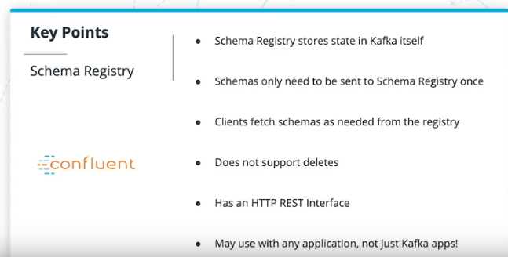

1. Java 1.8 install
2. JAVA_HOME is setup
3. Ubuntu Confluent Installation
    * Install the Confluent public key, which is used to sign the packages in the APT repository.
        $ wget -qO - https://packages.confluent.io/deb/3.3/archive.key | sudo apt-key add -
    * Add the repository to your /etc/apt/sources.list:
        $ sudo add-apt-repository "deb [arch=amd64] https://packages.confluent.io/deb/3.3 stable main"
    * Run apt-get update and install Confluent Platfor for Open Source
        $ sudo apt-get update && sudo apt-get install confluent-platform-oss-2.11

        https://docs.confluent.io/3.3.0/installation/installing_cp.html
        https://docs.confluent.io/3.3.0/quickstart.html#quickstart

4. Python3.7
5. pip3 install confluent-kafka
6. Start the Confluent
    confluent start schema-registry

Alternatively, to manually start each service in its own terminal, the equivalent commands are:
  ```
    $  /usr/bin/zookeeper-server-start ./etc/kafka/zookeeper.properties
     $  /usr/bin/kafka-server-start ./etc/kafka/server.properties
     $  /usr/bin/schema-registry-start ./etc/schema-registry/schema-registry.properties
   ```

In case multiple Python3/Java are present, then run below and choose the right
  ```
  sudo update-alternatives --config python3
  JAVA_HOME=/usr/lib/jvm/java-8-openjdk-amd64/jre/  in sudo vi /etc/environment and then source /etc/environment
  ```


https://kafka.apache.org/documentation.html#topicconfigs


## Kafka Producer
  * Synchronous Producer->
                        * data is sent before application proceeds further. It
                        should not be default choice but if there is a specific
                        need.
                        * In Python, flush function on python makes producer sync

  * Async producer -> Its most common method. Max throughput of Kafka .
                    It should be default choice.Producer can be configured on
                    fire and forgot mechanism

### Kafka producer properties
  * client.id -> All producers should provide for better debugging experience

  * enable.idempotennce for true in-order retry

  * Configure retry to ensure data is delivered

  * Configure compression on individual topics. compression will happen on client.

  * Kafka producer libraries batch messages together for efficiency.  It is done for performance reasons.time, count and size of these batches are configurable.

  * https://github.com/edenhill/librdkafka/blob/master/CONFIGURATION.md

  *  https://kafka.apache.org/documentation/#producerconfigs

  *  https://docs.confluent.io/current/clients/confluent-kafka-python/index.html?highlight=serializer#producer


## Kafka Consumer

  * Kafka keeps track of what data a consumer has seen with offsets

  * Kafka stores offsets in a private internal topic

  * By default, commits are made async and done automatically.

  * Consumer groups rebalances when a consumer leaves or join the consumer group.
  * client.id is optional for consumers
  * group.id is mandatory for consumers.

    
    

    There are 2 methods to fetch data from kafka in consumer
          * poll
          * Consume: Consume takes the batch of messages and it returns
                      the list of message

    

    * Consumer config options : https://kafka.apache.org/documentation/#consumerconfigs

    * Confluent_kafka_python Options: https://docs.confluent.io/current/clients/confluent-kafka-python/index.html?highlight=serializer#consumer

    * librdkafka consumer options shared with confluent_kafka_python: https://github.com/edenhill/librdkafka/blob/master/CONFIGURATION.md


## Message Serialization

   * Process of transforming application internal data into a data model
    suitable for data stores is called as Serialization.

   * eg. JSO, AVRO

   * Kafka does not handle Serialization but kafka client library handles it.

   * Never change Serialization on a topic.

## Data Scehmas and Apache Avro


## Apache AVRO
* Avro: Data Serialization system that uses binary compression.
* AVRO apache documentation
    https://avro.apache.org/docs/1.8.2/spec.html#schemas
* name, type, fields are mandatory
* type must be the first

* confluent_kafka_python Avro Producer : https://docs.confluent.io/current/clients/confluent-kafka-python/index.html?highlight=partition#confluent_kafka.avro.AvroProducer
* confluent_kafka_python Avro Consumer : https://docs.confluent.io/current/clients/confluent-kafka-python/index.html?highlight=partition#confluent_kafka.avro.AvroConsumer

 
 

## Schema Registry

* Confluent Schema Registry is an open-source tool that provides centralized Avro Schema storage.
* Schemas only need to be sent to Schema Registry once
* Schema registry donot support deletes by default
* Has an HTTP ReST interface
* Webserver build on JVM.
* Stores all of it state in Kafka topics, not a database
* Exposes an HTTP web-server with a REST API
* Can Run standalone or clustered with many nodes
* Uses zookeeper to choose leader in cluster mode
* Many Kafka clients natively support Schema Registry interactions for you
* Reduces network overhead, allowing producers and consumers to register schemas one time
* Simplifies using Avro, reducing the barrier to entry for developers
* Uses a Kafka topic to store state
* Deployed as one or more web servers, with one leader
* confluent_kafka_python Avro and Schema Registry support : https://docs.confluent.io/current/clients/confluent-kafka-python/index.html?highlight=partition#module-confluent_kafka.avro

* Schema Registry Overview https://docs.confluent.io/current/schema-registry/index.html
* Schema Registry HTTP API Documentation https://docs.confluent.io/current/schema-registry/develop/api.html





## Confluent AVRO

* sudo apt-get install python3.7-dev
* pip3 install "confluent-kafka[avro]"


## Kafka Console Consumer
kafka-console-consumer --topic "com.udacity.lesson3.exercise2.clicks" --bootstrap-server PLAINTEXT://localhost:9092


## Delete Kafka Topics
   * ensure that delete.topic.enable = true in server.properties file
   * kafka-topics --delete --topic "org.udacity.exercise3.purchases" --zookeeper localhost:2181
   * kafka-topics --list --zookeeper localhost:2181


## Kafka Connect

* Kafka Connect is a web server and framework for integrating Kafka with external data sources such as SQL databases, log files, and HTTP endpoints

* Built in Scala and Java.

* Built on JVM.

* When Kafka connect web server boots up, it locate and loads the Kafka plug-in JAR

* kafka connect plugin are written in a JVM like language like Java

* Kafka connect uses kafka to store its CONFIGURATION and track its internal state

* it can be run as a single node or as a cluster.

* https://docs.confluent.io/current/connect/concepts.html

* Connect is entirely managed through a REST API

### Kafka Connect Connector Plugins

* Here are some popular Kafka Connect plugins:

    * Confluent Kafka Connect Plugin Search
    * Amazon S3 Connector
    * SQL JDBC Connector
    * HDFS Connector
    * HTTP Connector

* confluent start connect to start from Confluent CLI


